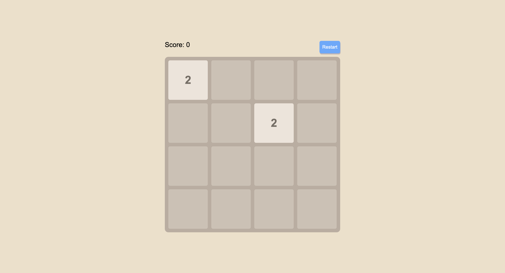

## my 2048 application

> use simple javascript and html and alse css to build an easy application without any framework.
> just for fun

### 游戏实现逻辑

2048就是个4 * 4的格子游戏所以可以设置一个4 * 4的矩阵来维护这个游戏中的格子

例如
```js
let board = [
    [0, 0, 0, 0],
    [0, 0, 0, 0],
    [0, 0, 0, 0],
    [0, 0, 0, 0],
]
```

所有的格子移动，格子合并，新格子生成，都可以以这个矩阵内的数据作为依据渲染

#### 1.格子的移动与合并

可以清晰想到，格子的移动分为四个方向，左右上下，同时每个方向都有合并的功能

##### 1.1左移与合并

举例，当前board为
```js
[
    [0,2,0,2],
    ......,
    ......,
    ......
]
```
以第一行为例子，当按下⬅️时

1. 获取当前行row，`row = board[r]`，即row = `[0,2,0,2]`
2. 将row中的0数据移除，row变为`[2,2]`
3. 从前往后遍历row，如果某个数据与后一位数据相同，则将其“合并”即✖️2，而后一位则置为0
4. 记录是哪个位置的格子进行了合并，辅助后面提到的合并放大动画效果
5. 最后将row中的0移除数组，同时给row“补位”，添0
6. 最后row变更为`[4,0,0,0]`

```js
function moveCells() {
    let moved = false
    for(let r = 0; r < 4; r++) {
        let row = board[r].filter(it => it !== 0) // step1、2获取row，同时去掉当中的0
        for(let c = 0; c < row.length - 1; c++) {
            if (row[c] === row[c + 1]) {
                row[c] *= 2
                row[c + 1] = 0
                mergedCells.push({r, c})
                moved = true
            }
        }
    }
    row = row.filter(it => it.val !== 0)
    while(row.length < 4) row.push(0)
    return moved
}
```

##### 1.2右移与合并

同样的道理，无论是右移还是上移下移，只要将上面这6步中的某些步骤稍作更改即可，例如从前往后改为从后往前，获取row改为获取col等等，所以我们是不是可以将上面的内容封装起来，加入传参，给不同的方向使用？

实际上更为简洁的办法是，观察到无论是右移还是上下移动，都可以看作是左移的变式，例如右移实际上将row的顺序颠倒的左移，因此可以轻松想到将row反转，再左移，最后再将得到的结果反转，得到的board也是正确的

```js
function moveRight() {
    rotateRows()
    const moved = moveCells()
    rotateRows()
    return moved
}

function rotateRows() {
    for(let r = 0; r < 4; r++) {
        board[r].reverse()
    }
}
```

##### 1.3上移与合并

同样的，我们可以根据右移的思路去往这种调换矩阵位置先左移再xx的思想去靠，可以猜想是不是可以通过某种关系达到

例如

```js
[
    [0,2,0,2],
    [0,2,2,0],
    ......,
    ......
]
```

怎么将上移对应到左移的矩阵呢，左移是将每一行左移，上移是将每一列“左移”，我们只需要把每一列当成“一行”来“左移”，因此实际上只需要转置矩阵，将矩阵左移，最后再转回去

```js
function transpose() {
    let newBoard = [
        [0,0,0,0],
        [0,0,0,0],
        [0,0,0,0],
        [0,0,0,0]
    ]
    for (let r = 0; r < board.length; r++) {
        for (let c = 0; c < 4; c++) {
            newBoard[r][c] = board[c][r]
        }
    }
}

function moveUp() {
    transpose()
    const moved = moveCells()
    transpose()
}

```

##### 1.4下移与合并

同样的，可以理解到下移就是每一列往“右移”，因此需要转置矩阵，同时再倒转每一行，然后左移，最后再倒转每一行，再转回去

```js
function moveDown() {
    transpose()
    rotateRows()
    const moved = moveCells()
    rotateRows()
    transpose()
    return moved
}
```

#### 2.视图渲染

渲染视图在没有添加动画效果之前算是比较简单，只需要根据board中给出的数据进行渲染，遍历board，当遇到非0数据，根据其数据值大小，给予不同的样式（颜色）

```js
function updateBoardView() {
  const container = document.getElementById("grid-container")
  container.innerHTML = ""

  for (let r = 0; r < 4; r++) {
    for (let c = 0; c < 4; c++) {
      const val = board[r][c]
      const cell = document.createElement("div")
      cell.className = "cell"
      if (val !== 0) {
        cell.textContent = val
        cell.classList.add("cell-" + val)
        cell.id = `cell-${r}-${c}`        
      }
      container.appendChild(cell)
    }
  }
```

#### 3.游戏规则边界（结束与重玩）

游戏结束的标志，无非就是格子占满了，同时无论是向左右上下移动都无法合并任何一对格子（游戏合成了2048按道理是可以继续玩下去的）

##### 3.1游戏结束

很简单，按照上面说的逻辑分两步完成校验

1. 判断当前游戏是不是还有空格，即board中是不是还存在0数据
2. 判断横向和竖向是否存在能合并的格子

```js
// 返回值表示是否结束
function isGameOver() {
    // 空格判断
    for (let r = 0; r < 4; r++) {
        for (let c = 0; c < 4; c++) {
            if (board[r][c] === 0) return false
        }
    }
    // 横向判断
    for (let r = 0; r < 4; r++) {
        for (let c = 0; c < 3; c++) {
            if (board[r][c] === board[r][c + 1]) return false
        }
    }
    // 竖向判断
    for (let c = 0; c < 4; c++) {
        for (let r = 0; r < 3; r++) {
            if (board[r][c] === board[r + 1][c]) return false
        }
    }

    return true
}
```

至此一个简易的2048游戏就顺利编写完毕

### 动画逻辑

动画逻辑主要是补充三点
>1. 新生成格子放大效果
>2. 格子合并放大效果
>3. 格子平滑移动效果

#### 新生成格子的出现效果

在随机生成新数字函数内标记新生成的格子的坐标，在后面渲染视图的时候添加上对应的动画效果，使用数组存储坐标对象，是因为游戏初始化会有两个新的格子。

对应的步骤为
1. 补充放大效果样式
2. 找出哪些是新增的格子
3. 渲染时加上对应的样式

##### 1.补充放大效果样式
```css
.cell {
    transition: transform .3s ease;
}

.new {
    animation: pop .3s ease;
}

@keyframe pop {
    0% {
        transform: scale(0)
    }
    50% {
        transform: scale(1.1)
    }
    100% {
        transform: scale(1)
    }
}
```

##### 2.找出哪些是新增的格子

`generateRandom`在代码里承担的就是生成随机新格子的任务，因此我们在这个函数里标记新格子的位置即可

```js
function generateRandom (){
    // ......

    newCells.push({r, c})
}
```

##### 3.渲染时加上对应的样式

然后在视图渲染的时候，遍历`newCells`中的数据，逐一加上`.new`

```js
function updateBoardView() {
    // .......
    newCells.forEach((cl) => {
        if (cl && cl.r === r && cl.c === c) {
            cell.classList.add('new')
        }
    })
}
```

#### 两个格子合并的合并放大效果

同样的也是分为三步
1. 补充合并的样式
2. 找出哪些格子是合并而来的
3. 渲染时增加对应的样式

##### 1.补充合并的样式

```css
.merged {
  animation: mergePop 0.25s ease;
}

@keyframes mergePop {
  0% {
    transform: scale(1);
  }
  50% {
    transform: scale(1.2);
  }
  100% {
    transform: scale(1);
  }
}
```

##### 2.找出哪些格子是合并而来的

由于合并格子相关逻辑处理是在`moveCells`中处理，我们在该函数中记录即可

```js
function moveCells() {
    // ......
    mergedCells.push({r, c})
}
```

##### 3.渲染时增加对应的样式

最后在视图渲染`updateBoardView`中进行样式添加

```js
function updateBoardView() {
    // ......
    if (mergedCells.some(pos => pos.r === r && pos.c === c)) {
        cell.classList.add('merged')
    }
}
```


